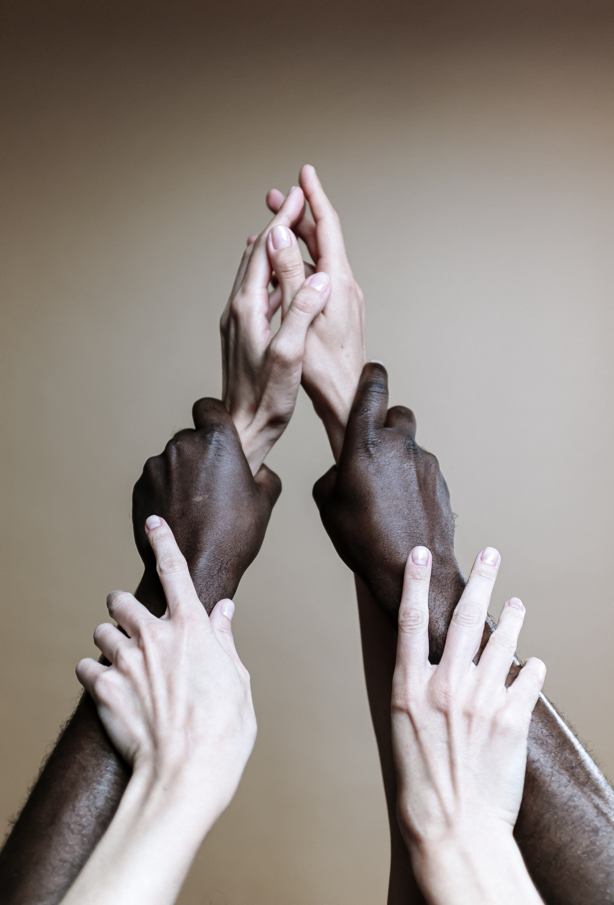

# quiz-estetica
 
# quiz-estetica
>

> <Descrição do projeto>
### Lista de tarefas
-Criar tela inicial
-Fazer as tela de pergunta 
-Criar a tela de resultados 

Segue a lista de tarefas a serem desenvolvidas no projeto:
- [] briefing e levantamento de requisitos
- [] prototipação
   
- [] validação inicial
- [] produção(programação)
    - [] criar repositório no github
    -cr
## 📝 Licença
Esse projeto está sob licença. Veja o arquivo [LICENÇA](LICENSE.md) para mais detalhes.
[⬆ Voltar ao topo](#QUIZ-ESTETICA) 
